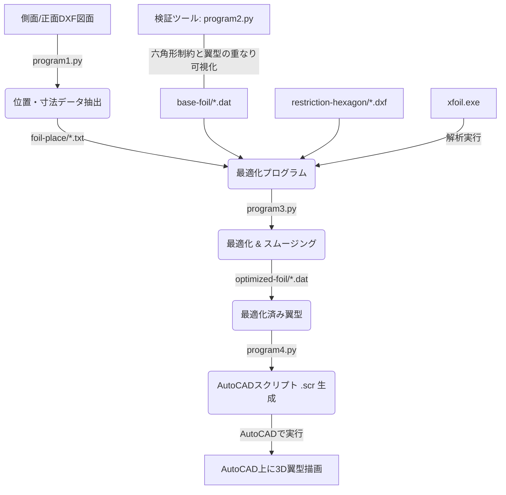

# フェアリング最適化・3Dモデリング支援プログラム (fairing-optimize-program)

本プロジェクトは、2Dの投影図（側面・正面のDXFファイル）からフェアリングの幾何学的特徴を抽出し、XFOILを用いた空力最適化および断面スムージングを行い、最終的にAutoCADで3Dモデルを自動生成するための支援ツール群です。

---

## ワークフローの全体像

本システムは以下の4つのPythonプログラムで構成されています。



---

## 必要システム・前提環境

### 1. 外部ソフトウェア / ツール
- **Python 3.8以上**
- **XFOIL (xfoil.exe)**: 翼型解析用の外部ソルバー。`program3.py` の実行時にローカルの `xfoil.exe` のパスを指定する必要があります。
  - [XFOIL 公式サイト](https://web.mit.edu/drela/Public/web/xfoil/) 等からあらかじめダウンロードしておいてください。
- **AutoCAD**: 最終的な3Dスプライン曲線を描画するために使用します（`.scr` スクリプトの読み込みに対応しているバージョン）。

### 2. 必要なPythonライブラリ
以下のPythonパッケージを使用します。

- **`ezdxf`**: DXFファイルの読み込みとAutoCADデータの処理
- **`numpy`**: 数値計算・データ読み込み
- **`matplotlib`**: 形状および制約条件の可視化 (`program2.py`)
- **`scipy`**: `savgol_filter` による翼型パラメータの3Dスムージング処理 (`program3.py`)

---

## インストール方法

### 1. ライブラリのインストール
コマンドプロンプトやPowerShellで、以下のコマンドを実行して必要なライブラリをインストールしてください。

```bash
pip install numpy matplotlib scipy ezdxf
```

---

## 各プログラムの使い方と詳細

### Step 1: 投影図からの寸法・配置データ抽出 (`program1.py`)
側面投影図と正面投影図のDXFファイルから、高さ40mm刻みで翼弦長（コード長）、最大厚み、前縁位置（X座標オフセット）を算出します。

- **実行コマンド**:
  ```bash
  python program1.py
  ```
- **入力**: 
  - 側面投影図DXFファイル名（`side-look/` 内に配置、拡張子不要）
  - 正面投影図DXFファイル名（`front-look/` 内に配置、拡張子不要）
- **出力**:
  - `chord-&-thickness/[フェアリング名]_chord_thick.txt`
  - `foil-place/[フェアリング名]_positions.txt`（後続のプログラムで参照）

---

### 検証ツール: 断面ごとの制約条件確認 (`program2.py`)
特定の高さにおいて、ベースとなる翼型（`base-foil`）が制約境界である六角形（`restriction-hexagon`）を完全に覆えているかを可視化・判定します。

- **実行コマンド**:
  ```bash
  python program2.py
  ```
- **入力**:
  - 調べたい制約の六角形DXF名（`restriction-hexagon/` 内、拡張子不要）
  - 調べたい基礎翼型DAT名（`base-foil/` 内、拡張子不要）
  - その断面での翼弦長 (mm)
- **機能**: 
  - 六角形が翼型の内側に完全に収まっているか判定し（`PASS` / `FAIL`）画面上にプロット表示します。

---

### Step 2: 翼型最適化・XFOIL解析・スムージング (`program3.py`)
本プロジェクトのコアとなるプログラムです。各断面（34箇所）において、内部の六角形制約をクリアしつつ、最も抵抗係数 $C_d$ が小さくなるように翼型の最大厚み位置（%）をシフト・最適化します。
さらに、最適化による形状の不連続を防ぐため、スパン（高さ）方向に対してパラメータのスムージング処理（Savitzky-Golayフィルタ）を適用した上で最終的な翼型を出力します。

- **実行コマンド**:
  ```bash
  python program3.py
  ```
- **手順**:
  1. ファイル選択ダイアログが表示されるので、PC内にある `xfoil.exe` を選択します。
  2. フェアリング名（例: `fairing-1`）を入力します。
  3. `foil-place/` 内にある位置情報ファイル名（例: `fairing-1_positions.txt`）を入力します。
  4. 設計機体速度 (m/s) を入力します（レイノルズ数計算に使用）。
- **出力**:
  - `optimized-foil/` フォルダ以下に、断面ごとの最適化＆スムージング済み翼型ファイル (`[フェアリング名]_optimized_[高さ].dat`) が34個生成されます。

---

### Step 3: AutoCAD 3D描画用スクリプト生成 (`program4.py`)
最適化された翼型群（`.dat`）をAutoCAD上に実寸法・実配置で3Dスプライン曲線として描画するためのコマンドスクリプト（`.scr`）を生成します。

- **実行コマンド**:
  ```bash
  python program4.py
  ```
- **入力**:
  - フェアリング名
  - 参照する位置情報ファイル名
- **出力**:
  - `AutoCAD-command/[フェアリング名]_draw_wings.scr`
- **AutoCADでの実行方法**:
  1. AutoCADを起動し、3D表示（等角投影など）に変更します。
  2. コマンドラインに `SCRIPT` と入力してEnterキーを押します。
  3. 生成された `.scr` ファイルを選択すると、自動で3D空間内に翼断面群が描画されます。

---

## ディレクトリ構成と役割

```text
fairing-optimize-program/
├── program1.py               # 投影図から位置・寸法データを抽出
├── program2.py               # 断面制約（六角形）と翼型の干渉チェックツール
├── program3.py               # XFOILを用いた翼型最適化＆スムージング
├── program4.py               # AutoCAD用3Dスプライン描画スクリプト生成
├── .gitignore                # Git追跡対象外の設定ファイル
├── README.md                 # 本ドキュメント
│
├── side-look/                # 側面投影図（DXF）の配置場所
├── front-look/               # 正面投影図（DXF）の配置場所
├── restriction-hexagon/      # 各断面の内部干渉制約（六角形DXF）の配置場所
├── base-foil/                # ベースとなる初期設計翼型（DAT）の配置場所
│
├── chord-&-thickness/        # program1.pyが出力する寸法データの保存先
├── foil-place/               # program1.pyが出力する位置・寸法データの保存先
├── optimized-foil/           # program3.pyが出力する最適化済み翼型の保存先
└── AutoCAD-command/          # program4.pyが出力するAutoCAD用スクリプトの保存先
```
